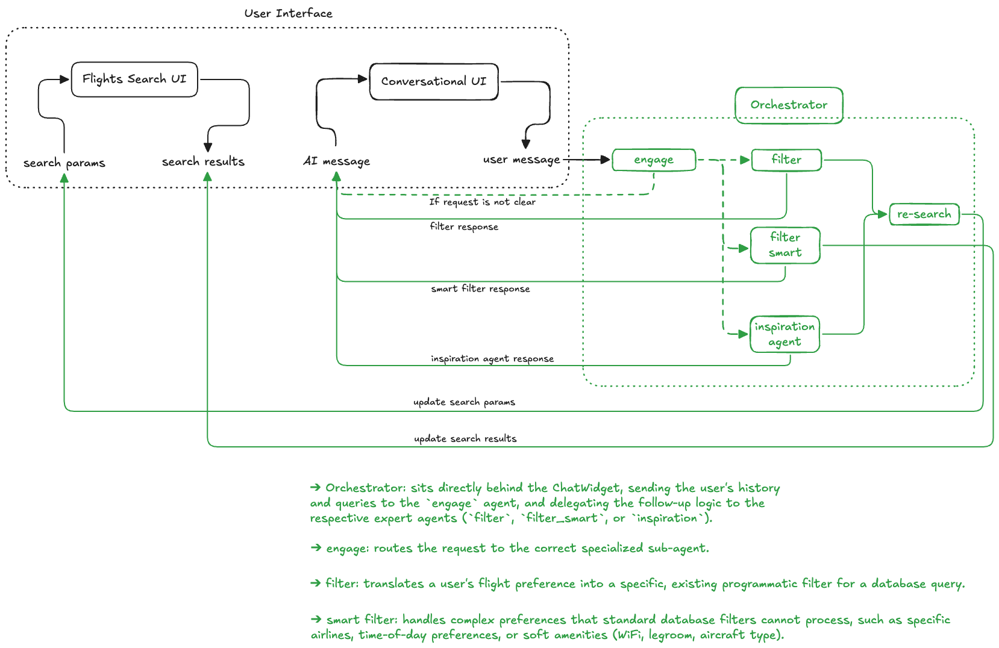

# ✈️ Flights Search & Filtering Multi-Agent System

Welcome to the **Flights Search Multi-Agent System**! This project is a modular, event-driven travel platform built with **Google ADK (Agent Development Kit)**, **Google Gemini 2.5**, **FastAPI**, and **React**.

It enables users to search for simulated flights and interactively refine results through a conversational **ChatWidget**—supporting hard parameter filtering, deep semantic filtering with live web research, open-ended travel inspiration, and self-healing JSON correction.

---

## 🏗️ System Architecture

The application is architected as a set of autonomous microservices coordinated by a central gateway and connected to an interactive frontend.



---

> **Note on Branches:** This branch (`local`) is configured for **local development and testing**, where all microservices and frontend communicate over `localhost`. For production deployment to **Google Cloud Run**, please refer to the `main` branch.

---

## 🤖 Microservices & Agents Overview

Each agent runs as an independent FastAPI microservice with its own dedicated documentation:

| Service | Port | Model / Tech | Role & Description | Documentation |
| :--- | :---: | :--- | :--- | :---: |
| **Orchestrator** | `8005` | FastAPI / Python | **Central Coordinator**: Triages user requests via `engage` and delegates to appropriate expert agents. | [README](agents/orchestrator/README.md) |
| **Engage Agent** | `8001` | Gemini 2.5 Pro | **Triage Specialist**: Analyzes user intent to route to `continue`, `filter`, `smart_filter`, or `inspiration_agent`. | [README](agents/engage/README.md) |
| **Filter Agent** | `8002` | Gemini 2.5 Pro | **Filter Extraction**: Translates natural language into deterministic database parameters (`direct`, `max_price`, `max_stops`). | [README](agents/filter/README.md) |
| **Smart Filter Agent** | `8003` | Gemini 2.5 Pro + Search | **Semantic Filter**: Evaluates qualitative amenities (WiFi, legroom, aircraft) via contextual reasoning and live Google Search. | [README](agents/filter_smart/README.md) |
| **Inspiration Agent** | `8007` | Gemini 2.5 Pro | **Discovery Architect**: Suggests destinations and date ranges for open-ended travel requests (*"somewhere sunny in December"*). | [README](agents/inspiration/README.md) |
| **Flights Search Agent** | `8006` | Gemini 2.5 Flash Lite | **Flight Simulator**: Generates 15 realistic, route-appropriate flight options obeying temporal and timezone logic. | [README](agents/flights_search/README.md) |
| **JSON Parser Agent** | `8004` | Gemini 2.5 Pro | **Structure Corrector**: Repairs malformed JSON outputs and guarantees strict schema compliance. | [README](agents/json_parser/README.md) |
| **Frontend** | `5173` | React / Vite | **User Interface**: Flight search exploration view with conversational ChatWidget. | [frontend/](frontend/) |

---

## 📁 Repository Structure

```text
flights_search/
├── agents/
│   ├── engage/              # Intent triage and routing microservice (:8001)
│   ├── filter/              # Deterministic parameter extraction microservice (:8002)
│   ├── filter_smart/        # Semantic filtering + live Google Search microservice (:8003)
│   ├── flights_search/      # Realistic flight search data simulation microservice (:8006)
│   ├── inspiration/         # Open-ended travel discovery microservice (:8007)
│   ├── json_parser/         # Self-healing JSON syntax & schema correction microservice (:8004)
│   └── orchestrator/        # Central FastAPI gateway coordinating the agents (:8005)
├── frontend/                # React + Vite frontend application & ChatWidget (:5173)
├── tests/                   # Microservice integration and unit tests
│   ├── engage/
│   ├── filter/
│   ├── filter_smart/
│   ├── flights_search/
│   ├── inspiration/
│   ├── json_parser/
│   └── orchestrator/
├── utils/                   # Shared logging and formatting utilities
└── requirements.txt         # Root Python dependencies
```

---

## 💻 Running the Application Locally

In this branch, all microservices and the React frontend communicate locally over `127.0.0.1` on their designated ports.

### 1. Prerequisites & Environment Setup
- **Python >= 3.11**
- **Node.js >= 18**
- Authenticate with Google Cloud for Gemini / Vertex AI models:
```bash
gcloud auth application-default login
```

Create and activate a virtual environment, then install root dependencies:
```bash
python3 -m venv .venv
source .venv/bin/activate
pip install -r requirements.txt
```

### 2. Configure Agent Environment Variables (`env.yaml`)
Ensure that all `env.yaml` files for the agents are updated with your Google Cloud **Project ID** and **Location/Region**:
- `agents/engage/env.yaml`
- `agents/filter/env.yaml`
- `agents/filter_smart/env.yaml`
- `agents/flights_search/env.yaml`
- `agents/inspiration/env.yaml`
- `agents/json_parser/env.yaml`

Update the following keys in each file:
```yaml
GOOGLE_CLOUD_PROJECT: "<YOUR_GCP_PROJECT_ID>"
GOOGLE_CLOUD_LOCATION: "<YOUR_GCP_LOCATION>" # e.g., europe-west9, us-central1
```

*(Note: For `agents/filter_smart/env.yaml` and `agents/flights_search/env.yaml`, provide your `SERPAPI_KEY` if live search is used).*

### 3. Start Backend Microservices (Local Uvicorn Servers)
Run each agent in a separate terminal (or in background processes):

```bash
# Terminal 1: Engage Agent (Port 8001)
python3 -m agents.engage.main

# Terminal 2: Filter Agent (Port 8002)
python3 -m agents.filter.main

# Terminal 3: Smart Filter Agent (Port 8003)
python3 -m agents.filter_smart.main

# Terminal 4: JSON Parser Agent (Port 8004)
python3 -m agents.json_parser.main

# Terminal 5: Flights Search Simulator (Port 8006)
python3 -m agents.flights_search.main

# Terminal 6: Inspiration Agent (Port 8007)
python3 -m agents.inspiration.main

# Terminal 7: Central Orchestrator Gateway (Port 8005)
python3 -m agents.orchestrator.main
```

### 4. Start the Frontend
In a new terminal:
```bash
cd frontend
npm install
npm run dev
```
Open **`http://localhost:5173`** in your browser to interact with the flight search engine and conversational chat widget.

### 5. Running Tests Locally
Tests can be run either in-memory or directly against the live local Uvicorn servers:

```bash
# 1. In-memory unit tests (FastAPI TestClient)
pytest

# Or run individual in-memory tests:
python -m tests.orchestrator.test
python -m tests.engage.test
python -m tests.filter.test
python -m tests.filter_smart.test
python -m tests.inspiration.test
python -m tests.json_parser.test
python -m tests.flights_search.test

# 2. Live HTTP Microservice tests (requires local Uvicorn servers to be running)
python -m tests.orchestrator.test_microservice
python -m tests.engage.test_microservice
python -m tests.filter.test_microservice
python -m tests.filter_smart.test_microservice
python -m tests.inspiration.test_microservice
python -m tests.json_parser.test_microservice
python -m tests.flights_search.test_microservice
```
